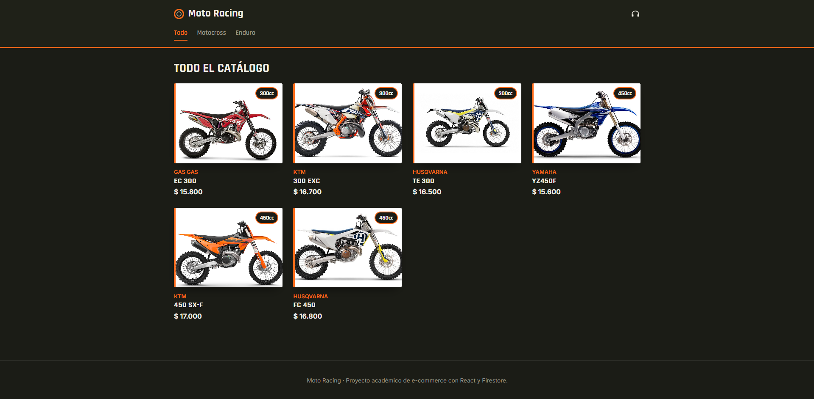

# 🏍️ Moto Racing

E-commerce de motos de **motocross** y **enduro** desarrollado con **React** y **Firebase (Firestore)**. El usuario puede explorar el catálogo, ver el detalle de cada moto, armar un carrito de compras y generar una orden que queda registrada en la base de datos.



**Repositorio:** https://github.com/Adrian13101/reactJS

---

## Índice

1. [Presentación](#1-presentación)
2. [Funcionalidades](#2-funcionalidades)
3. [Tecnologías](#3-tecnologías)
4. [Arquitectura](#4-arquitectura)
5. [Firestore](#5-firestore)
6. [Orden de ejemplo](#6-orden-de-ejemplo)
7. [Instalación](#7-instalación)
8. [Observaciones finales](#8-observaciones-finales)

---

## 1. Presentación

Moto Racing es una tienda online pensada para quienes buscan motos de competición. El catálogo tiene seis modelos organizados en dos categorías, más una vista general con todos los productos:

| Categoría | Modelos |
|-----------|---------|
| Motocross | Yamaha YZ450F, KTM 450 SX-F, Husqvarna FC 450 |
| Enduro | Gas Gas EC 300, KTM 300 EXC, Husqvarna TE 300 |
| Todo | Los seis modelos |

El proyecto fue desarrollado como entrega final de un curso de React.

---

## 2. Funcionalidades

Lo que puede hacer el usuario:

- **Explorar el catálogo** completo o filtrado por categoría (Motocross / Enduro) desde la barra de navegación.
- **Ver el detalle de cada moto:** foto, marca, año, cilindrada, tipo de motor, peso, descripción y precio.
- **Elegir la cantidad** a comprar con un selector que respeta el stock disponible. Si una moto no tiene stock, se muestra como agotada y no se puede agregar.
- **Agregar productos al carrito** y ver en la barra superior cuántas unidades lleva acumuladas.
- **Gestionar el carrito:** sumar o restar unidades (sin superar el stock), quitar productos, vaciarlo y ver subtotales y total.
- **Conservar el carrito** al recargar la página (se guarda en el navegador).
- **Finalizar la compra** completando nombre, email y teléfono, con validación de los campos.
- **Recibir un número de orden** al confirmar. La orden queda guardada en Firestore.
- **Ver una pantalla de "no encontrado"** si entra a una ruta o a una moto que no existe.

---

## 3. Tecnologías

| Tecnología | Versión | Uso |
|------------|---------|-----|
| React | 18.3 | Interfaz de usuario |
| React Router DOM | 6.26 | Navegación entre vistas |
| Context API | — | Estado global del carrito |
| Firebase (Firestore) | 10.14 | Base de datos de productos y órdenes |
| Vite | 5.4 | Entorno de desarrollo y build |
| firebase-admin | 12.3 | Solo para el script que carga el catálogo inicial |
| CSS | — | Estilos propios en `src/styles/global.css` |

---

## 4. Arquitectura

### 4.1 Estructura del proyecto

```
moto-racing/
├── public/motos/            # Fotos de las motos
├── img/                     # Capturas para este README
├── scripts/
│   └── seedFirestore.mjs    # Carga el catálogo inicial en Firestore
├── src/
│   ├── components/          # Un componente por carpeta
│   ├── context/
│   │   └── CartContext.jsx  # Estado global del carrito
│   ├── data/
│   │   └── mockProducts.js  # Catálogo base y categorías
│   ├── firebase/
│   │   └── config.js        # Inicialización de Firebase
│   ├── styles/global.css
│   ├── utils/formatPrice.js # Formato de precios en pesos argentinos
│   ├── App.jsx              # Rutas
│   └── main.jsx             # Punto de entrada (Router + CartProvider)
├── .env.example             # Variables de entorno requeridas (sin valores)
└── package.json
```

### 4.2 Context del carrito

El carrito se maneja con `CartContext`. Su `CartProvider` envuelve toda la aplicación en `main.jsx`, de modo que cualquier componente puede leer y modificar el carrito sin pasar props. Se consume con el hook `useCart()`, que lanza un error claro si se usa fuera del Provider.

**Estado:** `carrito`, un array de ítems con `id`, `nombre`, `marca`, `precio`, `imagen`, `stock` y `cantidad`. Se sincroniza con `localStorage` (clave `moto-racing-carrito`), por lo que sobrevive a una recarga.

**Valores y funciones que expone:**

| Nombre | Qué hace |
|--------|----------|
| `carrito` | Lista de ítems agregados |
| `agregarAlCarrito(producto, cantidad)` | Agrega la moto o, si ya estaba, suma la cantidad sin superar el stock |
| `quitarDelCarrito(id)` | Elimina un producto del carrito |
| `actualizarCantidad(id, cantidad)` | Cambia la cantidad, siempre entre 1 y el stock |
| `vaciarCarrito()` | Deja el carrito vacío (se usa al confirmar la compra) |
| `estaEnCarrito(id)` | Indica si una moto ya está en el carrito |
| `cantidadTotal` | Total de unidades (lo usa el ícono del carrito) |
| `totalCarrito` | Suma de `precio × cantidad` de todos los ítems |

### 4.3 Componentes

| Componente | Responsabilidad |
|-----------|-----------------|
| `NavBar` | Marca, links de categorías y acceso al carrito |
| `CartWidget` | Ícono del carrito con el contador de unidades |
| `ItemListContainer` | Consulta Firestore (todas las motos o por categoría) y maneja carga y error |
| `ItemList` | Muestra el listado o un mensaje si no hay motos |
| `Item` | Tarjeta de cada moto (foto, marca, nombre, cilindrada, precio, etiqueta "Sin stock") |
| `ItemDetailContainer` | Consulta Firestore por ID y maneja carga y "no encontrado" |
| `ItemDetail` | Ficha completa de la moto y confirmación al agregarla |
| `ItemCount` | Selector de cantidad con mínimo 1 y tope en el stock |
| `Cart` | Detalle del carrito, cantidades, subtotales y total |
| `Checkout` | Formulario del comprador, validación y creación de la orden |
| `Loader` | Indicador de carga |
| `NotFound` | Pantalla para rutas inexistentes |
| `Footer` | Pie de página |

### 4.4 Rutas

| Ruta | Vista |
|------|-------|
| `/` | Catálogo completo (`ItemListContainer`) |
| `/categoria/:categoriaId` | Catálogo filtrado: `motocross` o `enduro` |
| `/producto/:id` | Detalle de una moto (`ItemDetailContainer`) |
| `/carrito` | Carrito (`Cart`) |
| `/checkout` | Finalización de la compra (`Checkout`) |
| `*` | Pantalla de no encontrado (`NotFound`) |

---

## 5. Firestore

La base tiene dos colecciones.

### 5.1 Colección `productos`

Cada documento es una moto. El ID del documento coincide con el `id` del producto (por ejemplo `mx-001` para motocross y `end-001` para enduro).

| Campo | Tipo | Ejemplo |
|-------|------|---------|
| `nombre` | string | `"YZ450F"` |
| `marca` | string | `"Yamaha"` |
| `categoria` | string | `"motocross"` o `"enduro"` |
| `cilindrada` | number | `450` |
| `motor` | string | `"4 tiempos"` |
| `peso` | number (kg) | `108` |
| `precio` | number | `15600` |
| `stock` | number | `4` |
| `anio` | number | `2024` |
| `descripcion` | string | `"Motocross de 450cc con chasis de aluminio..."` |
| `imagen` | string | `"/motos/yamaha-yz450f.jpg"` |

Documento de ejemplo (ID `mx-001`):

```json
{
  "nombre": "YZ450F",
  "marca": "Yamaha",
  "categoria": "motocross",
  "cilindrada": 450,
  "motor": "4 tiempos",
  "peso": 108,
  "precio": 15600,
  "stock": 4,
  "anio": 2024,
  "descripcion": "Motocross de 450cc con chasis de aluminio y suspensión KYB totalmente ajustable.",
  "imagen": "/motos/yamaha-yz450f.jpg"
}
```

### 5.2 Colección `ordenes`

Cada compra confirmada crea un documento nuevo con ID automático. Se genera en `Checkout` con `addDoc`. Su estructura se detalla en la sección siguiente.

---

## 6. Orden de ejemplo

Orden generada desde la aplicación, con **datos ficticios**:

```json
{
  "comprador": {
    "nombre": "Juan Pérez",
    "email": "juan.perez@example.com",
    "telefono": "2600000000"
  },
  "items": [
    { "id": "mx-001", "nombre": "YZ450F", "precio": 15600, "cantidad": 1 },
    { "id": "end-001", "nombre": "EC 300", "precio": 15800, "cantidad": 1 }
  ],
  "total": 31400,
  "fecha": "Timestamp (serverTimestamp de Firestore)"
}
```

| Campo | Descripción |
|-------|-------------|
| `comprador` | Datos ingresados en el formulario (nombre, email y teléfono) |
| `items` | Motos compradas, con `id`, `nombre`, `precio` unitario y `cantidad` |
| `total` | Suma de `precio × cantidad` de todos los ítems |
| `fecha` | Fecha y hora asignadas por el servidor de Firestore |

Al confirmar la compra, el usuario ve en pantalla el ID que Firestore le asignó a la orden y el carrito se vacía.

---

## 7. Instalación

**Requisitos:** Node.js 18 o superior, npm y un proyecto de Firebase con Firestore creado.

### 1. Clonar el repositorio e instalar dependencias

```bash
git clone https://github.com/Adrian13101/reactJS.git
cd reactJS
npm install
```

### 2. Crear el proyecto de Firebase

1. En la [consola de Firebase](https://console.firebase.google.com/), creá un proyecto.
2. Activá **Firestore Database**.
3. Registrá una **app web** (ícono `</>`) en *Configuración del proyecto → Tus apps* y copiá los valores de configuración que te muestra.

### 3. Configurar las variables de entorno

```bash
cp .env.example .env
```

Completá el archivo `.env` con los valores de tu app web:

```
VITE_FIREBASE_API_KEY=
VITE_FIREBASE_AUTH_DOMAIN=
VITE_FIREBASE_PROJECT_ID=
VITE_FIREBASE_STORAGE_BUCKET=
VITE_FIREBASE_MESSAGING_SENDER_ID=
VITE_FIREBASE_APP_ID=
```

> 🔒 `.env` y `serviceAccountKey.json` están en `.gitignore` y **no se suben al repositorio**. Nunca pegues estos valores en el código, en capturas ni en documentos compartidos.

### 4. Permitir el acceso desde la app

En Firestore, pestaña **Reglas**, la app necesita poder leer `productos` y crear documentos en `ordenes`. Una configuración mínima para desarrollo:

```
rules_version = '2';
service cloud.firestore {
  match /databases/{database}/documents {
    match /productos/{id} {
      allow read: if true;
    }
    match /ordenes/{id} {
      allow create: if true;
    }
  }
}
```

### 5. Cargar el catálogo en Firestore

El script `scripts/seedFirestore.mjs` carga las seis motos de `src/data/mockProducts.js` en la colección `productos`. Usa una clave de cuenta de servicio, distinta de las credenciales del `.env`:

1. En Firebase: *Configuración del proyecto → Cuentas de servicio → Generar nueva clave privada*.
2. Guardá el archivo como `serviceAccountKey.json` en la raíz del proyecto.
3. Ejecutá:

```bash
npm run seed
```

Al terminar, el script informa cuántas motos cargó. Esa clave es privada: no la compartas ni la subas a ningún lado.

### 6. Ejecutar el proyecto

```bash
npm run dev
```

La aplicación queda disponible en `http://localhost:5173`.

Para generar la versión de producción: `npm run build`.

---

## 8. Observaciones finales

### Decisiones de diseño

- **Context API para el carrito.** Lo necesitan la ficha de producto, el ícono de la barra, el carrito y el checkout; con Context se comparte sin pasar props entre componentes. El hook `useCart` falla con un mensaje claro si se usa fuera del Provider.
- **Carrito persistente.** Se guarda en `localStorage` para que no se pierda al recargar la página.
- **El stock se respeta en dos lugares:** en el selector `ItemCount` y dentro del Context, para que ninguna combinación de acciones permita superar las unidades disponibles.
- **Firestore como fuente de datos.** Una consulta que responde sin resultados se muestra como tal (por ejemplo, una categoría sin motos cargadas). El catálogo local de `mockProducts.js` solo se usa como respaldo cuando hay un **error real de conexión**, y la interfaz avisa que está mostrando datos de ejemplo.
- **Credenciales fuera del código.** La configuración de Firebase se lee de variables de entorno (`VITE_*`) y se entrega un `.env.example` sin valores.
- **Script de carga separado.** El catálogo inicial se carga con `firebase-admin` desde un script de Node, con una clave de cuenta de servicio que nunca forma parte de la app que corre en el navegador.
- **Catálogo acotado y retematizado.** El proyecto partió de una tienda de música y se adaptó por completo al rubro de motos, con seis modelos y fotos reales.

### Dificultades y cómo se resolvieron

- **Resultados vacíos confundidos con errores de conexión.** Al principio, una categoría sin productos podía terminar mostrando el catálogo de respaldo. Se separó el caso "Firestore respondió sin datos" del caso "falló la conexión".
- **Credenciales de Firebase.** Se movieron a variables de entorno y se agregaron `.env` y `serviceAccountKey.json` al `.gitignore`.
- **Script de carga en Windows.** El `import()` dinámico del script requería una URL y no una ruta cruda; se resolvió con `pathToFileURL`.
- **Cantidades por encima del stock.** Se limitaron en el selector y en las funciones del Context.

### Mejoras futuras

- Descontar el stock en Firestore al confirmar una compra.
- Agregar autenticación de usuarios y un historial de órdenes.
- Endurecer las reglas de Firestore antes de un uso en producción.

---

## Autor

**Adrián Márquez** · [GitHub](https://github.com/Adrian13101)
